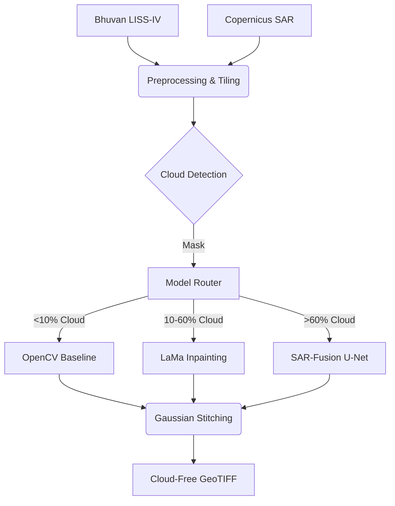

# LISS-IV Cloud Removal & Surface Reconstruction


An prototype Generative AI platform for automated cloud removal and surface reconstruction in LISS-IV satellite imagery, specifically targeting the North Eastern Region (NER) of India. 

**Developed for ISRO's BAH 2026 Hackathon by Team Antriksh.**

## 🚀 Features

- **Multimodal SAR-Fusion (Novel)**: Fuses C-band Sentinel-1 SAR data with LISS-IV optical data to reconstruct occluded areas based on structural ground-truth.
- **CPU-Optimized Inference**: Targeting ONNX export for inference acceleration on CPU-only hardware.
- **Geospatial Integrity**: Full GeoTIFF support. Processes data while preserving CRS (EPSG:32644) and metadata.
- **Interactive Web App**: A prototype Streamlit dashboard for visualizing the model architecture and inference workflow.
- **Spectral Fidelity**: Uses a custom Spectral Angle Mapper (SAM) loss during training to ensure NIR band consistency for downstream LULC and NDVI tasks.

## 🏗️ Architecture



## ⚙️ Installation

### 1. Local Environment
```bash
# Clone the repository
git clone https://github.com/team-antriksh/liss4_cloud_removal.git
cd liss4_cloud_removal

# Create virtual environment
python -m venv venv
source venv/bin/activate  # On Windows: venv\Scripts\activate

# Install requirements
pip install -r requirements.txt
```

### 2. Docker (Recommended for exact reproducibility)
```bash
docker-compose up --build
# App will be available at http://localhost:8501
```

## 🔑 Configuration

1. Copy `.env.example` to `.env`
2. Add your ISRO Bhuvan and ESA Copernicus credentials:
```env
BHUVAN_USERNAME=your_username
BHUVAN_PASSWORD=your_password
COPERNICUS_USER=your_username
COPERNICUS_PASSWORD=your_password
DEVICE=cpu
```

## 💻 Usage

### Launching the Dashboard
```bash
streamlit run app/streamlit_app.py
```

### Running the Pipeline via CLI
```python
from pipeline.cloud_detection import CloudDetectionPipeline
from models.lama.inference import LaMaInference

# Initialize
detector = CloudDetectionPipeline()
model = LaMaInference('configs/lama_config.yaml')

# Process
mask, _ = detector.process(cloudy_image)
cloud_free = model.inpaint(cloudy_image, mask)
```

## 📊 Evaluation Metrics

Run the comprehensive benchmark pipeline to evaluate the actual performance of the implemented models on the local dataset.
*Note: Metrics reported only after real training and validation.*

```bash
# 1. Download real Sentinel-1/Sentinel-2 data and train the models
python scripts/run_training.py --epochs 10

# 2. Run the benchmarking suite
python evaluation/benchmark.py
```

This will output `results/metrics_report.csv` containing measured PSNR, SSIM, LPIPS, and SAM scores.

## 📚 Documentation
- [Technical Report](docs/TECHNICAL_REPORT.md)
- [API Reference](docs/API_REFERENCE.md)

## 📄 License
This project is licensed under the MIT License - see the LICENSE file for details.

## 🙏 Acknowledgements
- [LaMa: Resolution-robust Large Mask Inpainting with Fourier Convolutions](https://github.com/saic-mdal/lama)
- ISRO NRSC for providing the Bhuvan LISS-IV portal.
